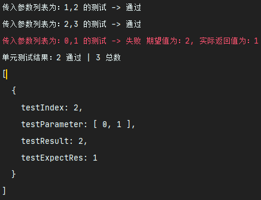
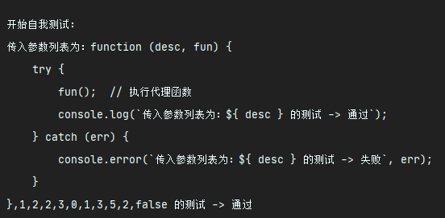

# JS 单元测试工具 - `UnitTest`

想要对自己写的 `JS` 代码进行单元测试但又不想给自己项目装上例如 `Jasmine`、`Qunit`、`jsUnit` 这些庞大的 `JS` 单元测试库？

那就直接使用 `UnitTest` 来对自己的 `JS` 代码进行单元测试吧。放心，`UnitTest` 仅仅只有 `2KB` 的大小，完全不用担心引入 `UnitTest` 对自己项目的性能造成影响。


## 1、文件目录介绍

- `out` - 模块使用说明文档文件夹
  - ... - 其他无关紧要的附属文件
  - `index.html` - 说明文档
- `unitTest_commonJS.js` - 提供给 `Common.js` 标准项目（例如 `node.js`）使用的模块
- `unitTest_ES6.js` - 提供给 `ES6` 标准项目（例如 `Vue`）使用的模块


## 2、使用方法

### 2.1、将你需要的文件拖入你想要放入的文件夹

例如将 `unitTest_ES6.js` 文件放入你自己项目的根目录下。

### 2.2、引入文件

对于使用 `ES6` 标准的项目来说，请导入 `unitTest_ES6.js` 这个文件。

```javascript
import { unitTestSet } from 'unitTest_ES6.js'

...
unitTestSet(fun, tsetList, resultList, debug);				// 使用 unitTestSet 进行单元测试
...
```

对于使用 `Common.js` 标准的项目来说，请导入 `unitTest_commonJS.js` 这个文件。

```javascript
let UnitTest = require('unitTest_commonJS');

...
UnitTest.unitTestSet(fun, tsetList, resultList, debug);		// 使用 unitTestSet 进行单元测试
...
```


## 3、详细使用方法

### 3.1、使用 `UnitTest`

要使用 `UnitTest` 来帮助自己实现单元测试，你需要提供一些东西：

- `testFun`：你要测试的函数
- `testList`：测试用例参数列表
- `resultList`：测试预期结果列表
- `debug`：是否开启未通过测试用例的详细错误堆栈信息，默认不开启

**给定数据**：

```javascript
// 这是一个加法函数
const add = function (a, b) {
    return a + b;
}

// 这是它的测试参数列表，它应该是一个二维数组的形式
//  [
//     [参数一, 参数二 ...],		// 测试用例一
//     [参数一, 参数二 ...],		// 测试用例二
//     [参数一, 参数二 ...]		// 测试用例三
//  ]
const testList = [
    [1, 2],
    [2, 3],
    [0, 1]
];

// 这是它的预测试计结果列表，它应该是一个一维数组的形式, 预计结果具体为何种类型取决于你自己的函数返回值格式
//  [
//     预计结果一,
//     预计结果二,
//     预计结果三
//  ]
const resultList = [
    3,
    5,
    2
];

const debug = false;

// 使用它
unitTestSet(add, testList, resultList, false);
```

**示例输出**：


### 3.2、获取未通过的单元测试用例信息

假设给定条件和 `3.1` 中一致，只需要命名一个变量来承接 `unitTestSet` 函数的返回值即可。

```javascript
const failTestList = unitTestSet(add, testList, resultList, false);
console.log(failTestList);
```

**示例输出**：




## 4、自我测试

一个好的单元测试当然可以测试自己是否正常，当然，由于自我测试会导致无意义的回调，前 `selfTestList.length` 个测试结果才是真正自我测试的单元测试案例。

**给定数据**：

```javascript
const testList = [
    [1, 2],
    [2, 3],
    [0, 1]
];

const resultList = [
    3,
    5,
    2
];

const selfTestList = [
    [unitTest, testList, resultList, false]
]

const selfResultList = [
    undefined
]

console.log('\n开始自我测试：');
unitTestSet(unitTestSet, selfTestList, selfResultList, false);
```

**示例输出**：


